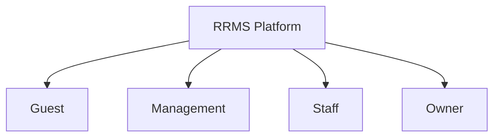
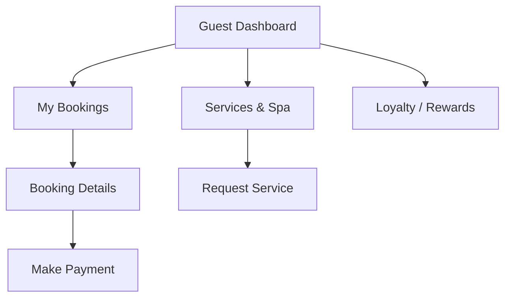
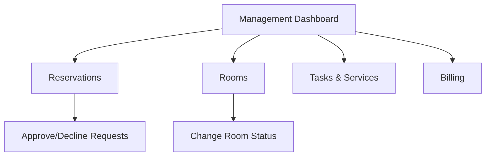
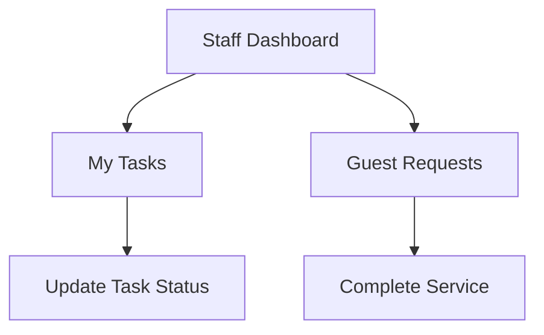
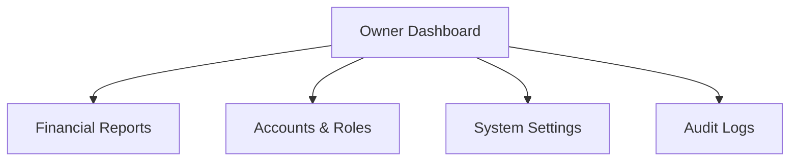
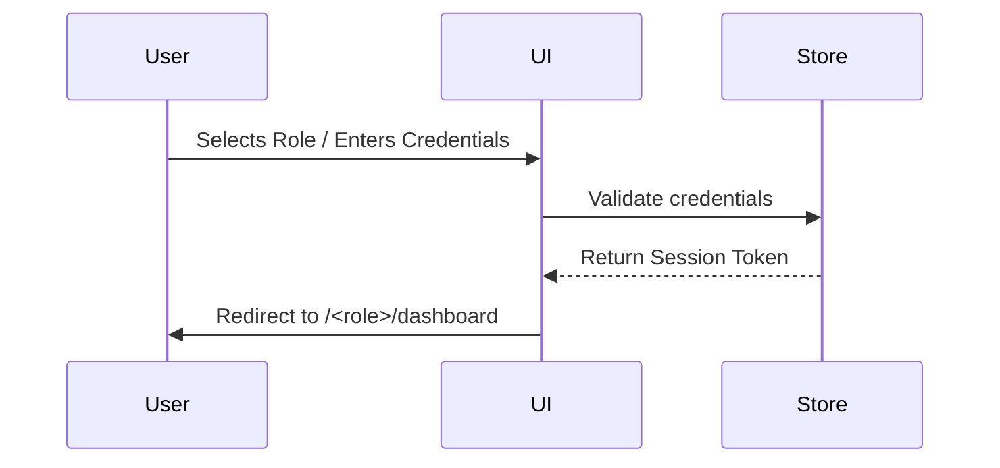

# RRMS UI Flow Documentation

## 1. Project Overview

**Project Name:** RRMS (Resort & Restaurant Management System)
**Purpose:** A modern, premium commercial resort management SaaS application. It provides distinct modules for Guests, Management, Staff, and Owners to handle operations, bookings, services, and reporting.
**Tech Stack:** React, TypeScript, Vite, TailwindCSS, Radix UI, Lucide Icons, Recharts, Framer Motion.

## 2. Design System

The new UI follows a modern, clean, and professional design system tailored for a luxury resort.

### Colors
- **Primary:** Deep navy / blue (`#0F172A`)
- **Background:** Soft neutral gray / cream (`#F8FAFC`)
- **Surface:** White (`#FFFFFF`)
- **Text:** Dark Slate (`#334155`) for readability.
- **Accents (by Module):**
  - Guest: **Blue** (`#3B82F6`)
  - Management: **Amber / Gold** (`#F59E0B`)
  - Staff: **Green** (`#10B981`)
  - Owner: **Purple** (`#8B5CF6`)

### Typography
- **Font Family:** `Inter` (Clean, modern, highly readable for SaaS data density).

### Core Components
- **Buttons:** Solid, Outline, Ghost, Soft variants. Rounded corners (`rounded-lg`).
- **Cards:** Clean white surfaces with soft shadows (`shadow-sm`, border `#E2E8F0`).
- **Tables:** Full-width, sortable headers, sticky headers, pagination controls, status badges.
- **Badges:** Soft background with distinct dot indicators (e.g., Green for active, Amber for pending).
- **Navigation:** Responsive Sidebar (desktop) collapsing to bottom navigation/hamburger menu (mobile).

## 3. Role Structure

## 4. Complete Navigation

**Desktop Layout:** Persistent Left Sidebar + Top Navbar (Breadcrumbs, Search, Profile).
**Mobile Layout:** Top Navbar (Hamburger) + Drawer / Bottom Navigation.

## 5. Guest UI Flow

Provides a premium booking and stay-management experience.

## 6. Management UI Flow

Operational control dashboard for daily resort management.

## 7. Staff UI Flow

Task-focused interface for housekeeping, maintenance, and service staff.

## 8. Owner UI Flow

High-level executive dashboard for analytics and configuration.

## 9. Authentication Flow

## 10. Complete Screen Inventory

1. **Dashboard** (Role-specific variants)
2. **Reservations** (Listing & Details)
3. **Rooms** (Listing & Details)
4. **Amenities**
5. **Tasks**
6. **Services**
7. **Billing**
8. **Guests** (Directory)
9. **Team** (Staff accounts)
10. **Support / Requests**
11. **Reports**
12. **Accounts & Permissions**
13. **Audit**
14. **Settings**
15. **Login**

## 11. Complete Tab Inventory

- **Reservations:** Upcoming, Active, Completed, Cancelled, Arrivals, In House.
- **Rooms:** Overview, All Rooms, Room Types, Pricing, Availability, Maintenance.
- **Tasks/Operations:** All, Open, In Progress, Resolved, Pending, Inspection.
- **Billing:** Payments, Refunds, Invoices.
- **Reports:** Daily, Weekly, Monthly, Yearly.

## 12. Complete Form Inventory

- **Login Form:** Email, Password.
- **Reservation Wizard:** 5-step (Guest, Dates/Room, Offer, Review, Credentials).
- **Room Form:** Add/Edit (Number, Type, Price, Capacity).
- **Room Status Form:** Change status, assign maintenance.
- **Task Assignment:** Select Role, Room, Priority.
- **Settings Form:** Resort details, Policies.

## 13. Complete Button / Action Inventory

- **Primary Actions:** `New Reservation`, `Add Room`, `Save Changes`, `Confirm Booking`.
- **Secondary Actions:** `Export CSV`, `View Details`, `Reset Filters`.
- **Status Actions:** `Check-in`, `Check-out`, `Approve`, `Decline`, `Start Work`, `Complete Task`.
- **Destructive:** `Cancel Reservation`, `Delete Room`, `Deactivate Account`.

## 14. Complete Modal Inventory

- **Reservation Wizard Modal** (Wide)
- **Room Details / Edit Modal**
- **Status Update Modal** (e.g., Marking room as Dirty)
- **Confirmation Dialog** (e.g., Confirm Delete)
- **Guest Credentials Modal** (Display generated password)

## 15. Dashboard Inventory

- **Guest:** Stay progress stepper, Quick concierge links, Loyalty points balance.
- **Management:** KPIs (Occupancy, Revenue), Today's Arrivals, Pending Requests.
- **Staff:** Urgent tasks list (High/Medium/Low priority), Shift schedule.
- **Owner:** Revenue trends chart, Booking conversion rate, Active staff.

## 16. Table Inventory

- **Reservations Table:** Guest Name, Room, Dates, Total, Status, View Action.
- **Rooms Table:** Room Number, Type, Capacity, Rate, Status Badge.
- **Tasks Table:** Room, Type, Priority, Assignee, Status.
- **Accounts Table:** Name, Email, Module, Role, Active Status.

## 17. Status Workflows

- **Room:** Ready → Occupied → Dirty → Cleaning → Inspection → Ready.
- **Reservation:** Pending → Confirmed → Checked-In → Completed (or Cancelled/No-Show).
- **Task:** Pending → In Progress → Inspection → Completed.

## 18. Responsive Behavior

- **Desktop (1024px+):** Expanded sidebar (240px wide). Data tables display all columns. Grid layouts use 3 or 4 columns for KPI cards.
- **Tablet (768px - 1023px):** Collapsed sidebar (icon only). Tables hide secondary columns (e.g., ID, secondary dates). Grid layouts use 2 columns.
- **Mobile (<768px):** Sidebar converts to a sliding drawer (hamburger menu). Tables convert into stacked cards. Modals take up full screen height/width.

## 19. Component Inventory

- `Button` (Variants: Primary, Outline, Ghost, Danger)
- `Badge` (Status indicators)
- `Card`, `CardHead`, `CardContent`
- `Modal`, `ConfirmDialog`
- `DataTable`, `Pagination`
- `Fields` (Auto-generating form layouts)
- `Tabs` (Horizontal scrolling on mobile)
- `Avatar`

## 20. API Integration Points

*(Currently managed in local state via `lib/store.tsx`)*
- `store.login(email, password)`
- `store.act(action, message)` -> Dispatches all state mutations (Create Room, Update Status, Checkout, etc.)
- `store.seed()` -> Populates initial mock data.

## 21. Mock Data

Realistic data generated via `domain.ts` seed function:
- **Guests:** "Elena Rostova", "Marcus Chen".
- **Rooms:** "101" (Ocean Suite), "204" (Garden Villa).
- **Prices:** ₹6,500 - ₹25,000 per night.
- **Tasks:** "AC not cooling", "Extra towels requested".

## 22. Validation Rules

- **Check-in Dates:** Must be >= today. Check-out must be > Check-in.
- **Discounts:** Cannot exceed maximum policy threshold (e.g., 20%).
- **Room Capacity:** Guest count cannot exceed room limit.
- **Required Fields:** All forms highlight missing required inputs before submission.

## 23. Error / Loading / Empty States

- **Loading:** Skeleton loaders for dashboards and tables (shimmer effect).
- **Empty States:** Clear illustrations with actionable buttons (e.g., "No tasks found. Take a break!").
- **Error States:** Toast notifications via `sonner` (e.g., "Unable to connect to server").

## 24. Complete User Journeys

**Example: Front Desk Walk-in Booking**
1. Manager clicks `New reservation`.
2. Selects Dates and Guest Count.
3. System filters available rooms; Manager selects a room.
4. Enters Guest details (Name, Email, Phone).
5. Applies any available promotional discount.
6. Reviews total price and confirms.
7. System generates demo credentials and marks room as Reserved.

## 25. Implementation Notes

- The new UI leverages **TailwindCSS** for rapid styling and consistency, replacing bespoke CSS classes.
- Existing React components in `ui.tsx` will be refactored to use `tailwind-merge` and `cva` for clean variant management.
- State management relies strictly on the existing `useStore` hook to ensure the business logic layer remains completely intact while the presentation layer is entirely overhauled.

---
**Note:** This file outlines the architectural plan for the new UI based on the existing functionality. It serves as the blueprint for the upcoming Tailwind/React UI rebuild.
